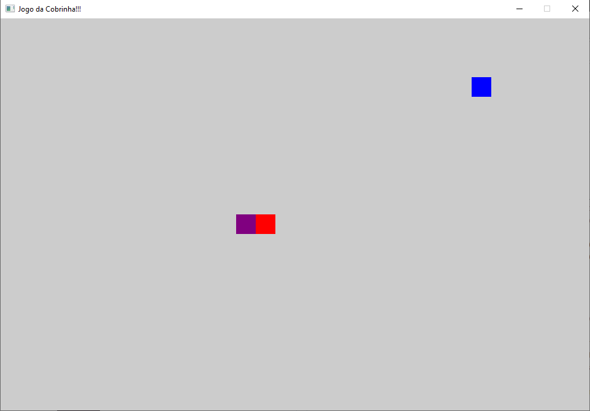

# JOGO DA COBRINHA
 Jogo feito na disciplina TECVII- Universidade federal de Pelotas 
Baseado no exemplo encontrado na biblioteca ggezÇhttps://github.com/ggez/ggez

REFERENCIAS 
https://rust-br.github.i
https://www.youtube.com/watch?v=DnT_7M7L7vo&t=464s
https://www.youtube.com/watch?v=iR7Q_6quwSI&t=2172s
https://www.youtube.com/watch?v=AYfehnFklkA
https://www.youtube.com/watch?v=8DUENLiOfiQ&t=1868s

Não esquecer de usar a biblioteza GGEZ [ggez](https://crates.io/crates/ggez)

## Requer
1. Precisa instalar o RUST [installed](https://www.rust-lang.org/en-US/install.html)
2.iNSTALE EM SEU CARGO.TOML [SDL2 libraries](https://github.com/Rust-SDL2/rust-sdl2#requirements)

fn main() -> GameResult {
    // Primeiro, criamos uma estrutura `ggez::Conf` que define as configurações do nosso jogo.
    let (ctx, event_loop) = ggez::ContextBuilder::new("Jogo da Cobrinha-=TECVII", "welder")
        // Primeiro, criamos uma estrutura `ggez::Conf` que define as configurações do nosso jogo.
        .window_setup(ggez::conf::WindowSetup::default().title("Jogo da Cobrinha!!!"))
       // Em seguida, chamamos a função `ggez::ContextBuilder::new` para criar um `ContextBuilder`,
    // que nos permitirá personalizar como queremos que o contexto seja criado.
        .window_mode(
            ggez::conf::WindowMode::default()
                .dimensions(SCREEN_SIZE.0 as f32, SCREEN_SIZE.1 as f32),
        )
        
        // CASO DE ERRADO, VAI DAR RUIM!!!!!!
        .build()
        .expect("DEU RUIM!!!!!!");
   // Em seguida, criamos uma instância do nosso `GameState` e a passamos para a função
    // `ggez::event::run` para iniciar o loop principal do jogo.
    let state = GameState::new()?;
   
    event::run(ctx, event_loop, state)
}

### Use cargo run no dicionário do projeto para rodar o jogo

// Primeiro, fiz a importação as crates necessárias para o nosso jogo:
// neste caso, apenas `ggez` e `rand`.
// Em seguida, devo "usar" as partes do ggez que vou precisar com frequência.
use ggez::event::KeyCode;
use ggez::{event, graphics, Context, GameResult};

// traz algumas coisas do `std` para suporte.
use std::collections::LinkedList;
use std::time::{Duration, Instant};

//  a trait `Rng` para o escopo para que possamos gerar e 
// alguns números aleatórios mais tarde.
use rand::Rng;

// de inicio devo fazer é configurar algumas constantes .

// Aqui defini o tamanho  tabuleiro de jogo em termos de quantas células da grade ele ocupará.
//opetei fazer um tabuleiro de 30 x 20.
const TAMANHO_GRADE: (i16, i16) = (30, 20);

// Agora definimos o tamanho em pixels de cada célula, que será de 32x32 pixels.
const TAMANHO_CELULA_GRADE: (i16, i16) = (32, 32);

// Em seguida,aqui o  quão grande queremos que nossa janela seja, multiplicando
// os componentes do nosso tamanho de grade pelo tamanho de pixel correspondente.
const TAMANHO_TELA: (u32, u32) = (
    TAMANHO_GRADE.0 as u32 * TAMANHO_CELULA_GRADE.0 as u32,
    TAMANHO_GRADE.1 as u32 * TAMANHO_CELULA_GRADE.1 as u32,
);

// Quatidade das    vezes queremos que nosso jogo seja atualizado por segundo.
// para que nossa cobra não se mova muito rápido na tela
// porque está se movendo uma célula inteira a cada quadro.
const ATUALIZACOES_POR_SEGUNDO: f32 = 8.0;

// E obtemos os milissegundos de atraso correspondentes a essa taxa de atualização.
const MILISEGUNDOS_POR_ATUALIZACAO: u64 = (1.0 / ATUALIZACOES_POR_SEGUNDO * 1000.0) as u64;

// Estrutura que conterá a posição de uma entidade em nosso tabuleiro de jogo
// ou grade  acima. Usamos inteiros com sinal porque queremos armazenar apenas números inteiros,
// e precisamos que sejam com sinal para que funcionem corretamente com nossa aritmética de módulo posteriormente.

#[derive(Clone, Copy, PartialEq, Eq, Debug)]
struct PosicaoGrade {
    x: i16,
    y: i16,
}

// Esta é uma trait que fornece uma função de módulo que funciona para valores negativos
// em oposição ao operador de resto padrão (%) que não o faz. Vamos usá-lo
// para fazer com que nossa cobra se mova de um lado do tabuleiro para o outro
// quando sair da parte superior, inferior, esquerda ou direita da tela.
trait ModuloAssinado {
    fn modulo(&self, n: Self) -> Self;
}

// Aqui implementamos nossa trait `ModuloAssinado` para qualquer tipo T que implemente
// `Add` (o operador `+`) com um tipo de saída T e Rem (o operador `%`)
// que também tem um tipo de saída T, e que pode ser clonado. Estas são as limitações
// de que precisamos para implementar uma função de módulo que funcione para números negativos.
impl<T> ModuloAssinado for T
where
    T: std::ops::Add<Output = T> + std::ops::Rem<Output = T> + Clone,
{
    fn modulo(&self, n: T) -> T {
        // Devido às nossas limitações de trait, agora podemos aplicar esses operadores.
        (self.clone() % n.clone() + n.clone()) % n
    }
}

impl PosicaoGrade {
    // Criamos uma função auxiliar padrão para que possamos criar uma nova `PosicaoGrade`
    // mais facilmente.
    pub fn nova(x: i16, y: i16) -> Self {
        PosicaoGrade { x, y }
    }

    // Assim como uma função auxiliar que nos dará uma `PosicaoGrade` aleatória de
    // `(0, 0)` a `(max_x, max_y)`
    pub fn aleatoria(max_x: i16, max_y: i16) -> Self {
        let mut rng = rand::thread_rng();
        // Podemos usar `.into()` para converter de `(i16, i16)` para uma `PosicaoGrade` já que
        // implementamos `From<(i16, i16)>` para `PosicaoGrade` abaixo.
        (rng.gen_range(0..max_x), rng.gen_range(0..max_y)).into()
    }

    // Faremos outra função auxiliar que leva uma posição de grade e retorna uma nova após
    // fazer um movimento na direção de `dir`. Usamos nossa trait `ModuloAssinado` acima,
    // que agora está implementada em `i16` porque ela atende aos requisitos da trait,
    // para fazer o movimento automaticamente se deslocar dentro do nosso tamanho de grade
    // se o movimento tivesse de outra forma nos movido para fora do tabuleiro para o topo,
    // parte inferior, esquerda ou direita.
    pub fn nova_com_movimento(pos: PosicaoGrade, dir: Direcao) -> Self {
        match dir {
            Direcao::Cima => PosicaoGrade::nova(pos.x, (pos.y - 1).modulo(TAMANHO_GRADE.1)),
            Direcao::Baixo => PosicaoGrade::nova(pos.x, (pos.y + 1).modulo(TAMANHO_GRADE.1)),
            Direcao::Esquerda => PosicaoGrade::nova((pos.x - 1).modulo(TAMANHO_GRADE.0), pos.y),
            Direcao::Direita => PosicaoGrade::nova((pos.x + 1).modulo(TAMANHO_GRADE.0), pos.y),
        }
    }
}

// Implementamos a trait `From` aqui, que neste caso nos permite converter facilmente entre
// uma `PosicaoGrade` e um `ggez` `graphics::Rect` que preenche aquela célula da grade.
// Agora podemos simplesmente chamar `.into()` em uma `PosicaoGrade` quando queremos um
// `Rect` que represente aquela célula da grade.
impl From<PosicaoGrade> for graphics::Rect {
    fn from(pos: PosicaoGrade) -> Self {
        graphics::Rect::new_i32(
            pos.x as i32 * TAMANHO_CELULA_GRADE.0 as i32,
            pos.y as i32 * TAMANHO_CELULA_GRADE.1 as i32,
            TAMANHO_CELULA_GRADE.0 as i32,
            TAMANHO_CELULA_GRADE.1 as i32,
        )
    }
}

// E aqui implementamos `From` novamente para nos permitir converter facilmente entre
// `(i16, i16)` e uma `PosicaoGrade`.
impl From<(i16, i16)> for PosicaoGrade {
    fn from(pos: (i16, i16)) -> Self {
        PosicaoGrade { x: pos.0, y: pos.1 }
    }
}

// Em seguida, criamos uma enumeração que representará todas as direções possíveis
// que nossa cobra pode se mover.
#[derive(Clone, Copy, Debug, PartialEq, Eq)]
enum Direcao {
    Cima,
    Baixo,
    Esquerda,
    Direita,
}

impl Direcao {
    // Criamos uma função auxiliar que nos permitirá obter facilmente o inverso
    // de uma `Direcao`, que podemos usar posteriormente para verificar se o jogador deve
    // ser capaz de mover a cobra em uma determinada direção.
    pub fn inverso(&self) -> Self {
        match *self {
            Direcao::Cima => Direcao::Baixo,
            Direcao::Baixo => Direcao::Cima,
            Direcao::Esquerda => Direcao::Direita,
            Direcao::Direita => Direcao::Esquerda,
        }
    }

    // Também criamos uma função auxiliar que nos permitirá converter entre um
    // `ggez` `KeyCode` e a `Direcao` que ela representa. Claro,
    // nem todo keycode representa uma direção, então retornamos `None` se esse
    // for o caso.
    pub fn de_keycode(key: KeyCode) -> Option<Direcao> {
        match key {
            KeyCode::Cima => Some(Direcao::Cima),
            KeyCode::Baixo => Some(Direcao::Baixo),
            KeyCode::Esquerda => Some(Direcao::Esquerda),
            KeyCode::Direita => Some(Direcao::Direita),
            _ => None,
        }
    }
}

// Esta é principalmente uma abstração semântica sobre uma `PosicaoGrade` para representar
// um segmento da cobra. Pode ser útil, por exemplo, ter cada segmento conter sua própria
// cor ou algo semelhante. Este é um exercício deixado ao leitor ;)
#[derive(Clone, Copy, Debug)]
struct Segmento {
    pos: PosicaoGrade,
}

impl Segmento {
    pub fn novo(pos: PosicaoGrade) -> Self {
        Segmento { pos }
    }
}

// Esta é novamente uma abstração sobre uma `PosicaoGrade` que representa
// uma peça de comida que a cobra pode comer. Ela pode se desenhar.
struct Comida {
    pos: PosicaoGrade,
}

impl Comida {
    pub fn nova(pos: PosicaoGrade) -> Self {
        Comida { pos }
    }

    // Aqui é a primeira vez que vemos como o desenho funciona com ggez.
    // Temos uma função que recebe uma referência a um `mut ggez::Context`, que usamos
    // com as funções auxiliares em `ggez::graphics` para desenhar. Também retornamos um
    // `ggez::GameResult` para que possamos usar o operador `?` para propagar falhas.
    fn desenhar(&self, ctx: &mut Context) -> GameResult {
        // Primeiro, precisamos criar um MeshBuilder
        let mesh = graphics::MeshBuilder::new()
            // Chamamos rectangle para criar um quadrado
            .rectangle(
                // Em seguida, desenhamos um retângulo com o modo de desenho Fill, e convertemos o
                graphics::DrawMode::fill(),
                // desde que implementamos `From<PosicaoGrade>` para `Rect` anteriormente.
                // A posição da Comida em um `ggez::Rect` usando `.into()`, que podemos fazer
                self.pos.into(),
                // Por fim, definimos a cor para desenhar, neste caso, toda comida será
                // colorida de azul.
                graphics::Color::new(0.0, 0.0, 1.0, 1.0),
            )?
            .build(ctx)?;

        graphics::draw(ctx, &mesh, graphics::DrawParam::default())?;
        Ok(())
    }
}

// Aqui definimos uma enumeração dos possíveis elementos que a cobra pode ter "comido"
// durante uma atualização do jogo. Ela pode ter comido um pedaço de `Comida`, ou
// ela pode ter comido `ElaMesma` se a cabeça colidir com seu corpo.
#[derive(Clone, Copy, Debug)]
enum Comeu {
    ElaMesma,
    Comida,
}

// Agora fazemos uma struct que contém todas as informações necessárias para descrever o
// estado da própria Cobra.
struct Cobra {
    // Primeiro, temos a cabeça da cobra, que é um único `Segmento`.
    cabeca: Segmento,
    // Em seguida, temos a direção atual da cobra. Esta é
    // a direção em que a cobra se moverá quando `update` for chamado.
    dir: Direcao,
    // Depois temos o corpo, que escolhemos representar como uma `LinkedList`
    // de `Segmento`s.
    corpo: LinkedList<Segmento>,
    // Agora temos uma propriedade que representa o resultado da última atualização
    // que foi executada. A cobra pode não ter comido nada (None), Comida (Some(Comeu::Comida)),
    // ou ElaMesma (Some(Comeu::ElaMesma))
    comeu: Option<Comeu>,
    // Finalmente, armazenamos a direção em que a cobra estava se movendo da última
    // vez que `update` foi chamado, que usaremos para determinar as direções válidas
    // em que ela pode se mover na próxima vez que `update` for chamado.
    ultima_dir_atualizacao: Direcao,
}

impl Cobra {
    pub fn nova(pos: PosicaoGrade) -> Self {
        let mut corpo = LinkedList::new();
        // Nossa cobra inicialmente terá uma cabeça e um segmento de corpo,
        // e estará se movendo para a direita.
        corpo.push_back(Segmento::novo((pos.x - 1, pos.y).into()));
        Cobra {
            cabeca: Segmento::novo(pos),
            dir: Direcao::Direita,
            ultima_dir_atualizacao: Direcao::Direita,
            corpo,
            comeu: None,
        }
    }

    // Uma função auxiliar que determina se
    // a cobra come uma dada peça de comida com base
    // em sua posição atual.
    fn comeu_comida(&self, comida: &Comida) -> bool {
        self.cabeca.pos == comida.pos
    }

    // Uma função auxiliar que determina se
    // a cobra se come com base em sua posição atual
    fn se_comeu(&self) -> bool {
        for seg in self.corpo.iter() {
            if self.cabeca.pos == seg.pos {
                return true;
            }
        }
        false
    }

    // A principal função de atualização de nossa cobra, que é chamada toda vez
    // que queremos atualizar o estado do jogo.
    fn atualizar(&mut self, comida: &Comida) {
        // Primeiro, obtemos uma nova posição da cabeça, usando nossa função auxiliar `nova_posicao`
        // a partir da direção atual da cobra.
        let nova_pos_cabeca = PosicaoGrade::nova_a_partir_de_movimento(self.cabeca.pos, self.dir);
        // Em seguida, criamos um novo segmento que será a nova cabeça usando a
        // nova posição que acabamos de criar.
        let nova_cabeca = Segmento::novo(nova_pos_cabeca);
        // Depois, colocamos o atual segmento da cabeça no início de nosso corpo
        self.corpo.push_front(self.cabeca);
        // E finalmente fazemos a nossa cabeça real ser o novo segmento que criamos.
        self.cabeca = nova_cabeca;
        // Em seguida, verificamos se a cobra comeu algo enquanto se atualizava e, se o fez,
        // definimos nossa propriedade `comeu` para refletir esse estado.
        if self.se_comeu() {
            self.comeu = Some(Comeu::ElaMesma);
        } else if self.comeu_comida(comida) {
            self.comeu = Some(Comeu::Comida);
        } else {
            self.comeu = None;
        }
        // Se não comeu nada nesta rodada, removemos o último segmento do nosso corpo,
        // dando a ilusão de que a cobra está se movendo. Na realidade, todos os segmentos
        // permanecem parados, apenas adicionamos um segmento na frente e removemos um
        // na parte de trás. Se comermos uma peça de comida, deixamos o último segmento
        // para que possamos aumentar nosso corpo em um.
        if self.comeu.is_none() {
            self.corpo.pop_back();
        }
        // E definimos nossa última direção de atualização como a direção em que acabamos
        // de nos mover.
        self.ultima_dir_atualizacao = self.dir;
    }

    // Aqui, a cobra se desenha. Isso é muito semelhante ao desenho da Comida
    // que vimos anteriormente.
    fn desenhar(&self, ctx: &mut Context) -> GameResult {
        // Primeiro, iteramos pelos segmentos do corpo e os desenhamos.
        for seg in self.corpo.iter() {
            // Primeiro, criamos um novo MeshBuilder
            let mesh = graphics::MeshBuilder::new()
                // Como queremos um quadrado, chamamos o método rectangle
                .rectangle(
                    // Em seguida, configuramos o modo de desenho para preencher o retângulo
                    graphics::DrawMode::fill(),
                    // Usamos `.into` (fornecido pelo `Into` em Rust) para converter nossa posição no tipo `mint` que a API do ggez quer
                    seg.pos.into(),
                    // Novamente, configuramos a cor (neste caso, todos os segmentos da cobra serão
                    // coloridos de roxo).
                    graphics::Color::new(0.5, 0.0, 0.5, 1.0), // Vermelho: 0.5, Verde: 0.0, Azul: 0.5, Alfa: 1.0
                )?
                .build(ctx)?;

            graphics::draw(ctx, &mesh, graphics::DrawParam::default())?;
        }
        // E então fazemos o mesmo para a cabeça, tornando-a totalmente vermelha para distingui-la.

        // E então fazemos o mesmo para a cabeça, tornando-a totalmente vermelha para distingui-la
        let mesh = graphics::MeshBuilder::new()
            .rectangle(
                graphics::DrawMode::fill(),
                self.cabeca.pos.into(),
                graphics::Color::new(1.0, 0.0, 0.0, 1.0),
            )?
            .build(ctx)?;

        graphics::draw(ctx, &mesh, graphics::DrawParam::default())?;
        Ok(())
    }
}

// Agora temos o coração do nosso jogo, o GameState. Esta struct
// implementará a trait `EventHandler` do ggez e, portanto, irá controlar
// tudo o que acontece no nosso jogo.
struct GameState {
    // Primeiro, precisamos de uma Cobra
    cobra: Cobra,
    // Uma peça de Comida
    comida: Comida,
    // Se o jogo acabou ou não
    fim_de_jogo: bool,
    // E rastreamos a última vez que atualizamos para limitar
    // nossa taxa de atualização.
    ultima_atualizacao: Instant,
}

impl GameState {
    // Nossa função new configurará o estado inicial do nosso jogo.
    pub fn novo() -> GameResult<Self> {
        // Primeiro, colocamos nossa cobra a um quarto do caminho na largura da grade
        // e no meio da altura da grade. Isso funciona bem, já que começamos movendo para a direita.
        let posicao_inicial = (TAMANHO_GRADE.0 / 4, TAMANHO_GRADE.1 / 2).into();
        // Em seguida, escolhemos uma posição aleatória para colocar nossa peça de comida usando a função auxiliar que fizemos anteriormente.
        let posicao_comida = PosicaoGrade::aleatoria(TAMANHO_GRADE.0, TAMANHO_GRADE.1);

        Ok(GameState {
            cobra: Cobra::nova(posicao_inicial),
            comida: Comida::nova(posicao_comida),
            fim_de_jogo: false,
            ultima_atualizacao: Instant::now(),
        })
    }
}

// Agora implementamos EventHandler para GameState. Isso nos permitirá
// controlar o que acontece em nosso jogo em resposta a eventos como atualizações
// de quadros ou entradas do usuário.
impl event::EventHandler for GameState {
    // Aqui implementamos o tratamento de atualização de quadros. Isso é chamado
    // uma vez a cada quadro (geralmente cerca de 60 vezes por segundo, mas podemos
    // definir nossa própria taxa de atualização se quisermos).
    fn update(&mut self, ctx: &mut Context) -> GameResult {
        // Primeiro, verificamos quanto tempo se passou desde a última atualização.
        // Isso nos permite controlar a taxa de atualização do nosso jogo.
        let agora = Instant::now();
        let delta_time = agora.duration_since(self.ultima_atualizacao);
        if delta_time.as_millis() >= MILISEGUNDOS_POR_ATUALIZACAO {
            // Se tempo suficiente passou, atualizamos o jogo.
            // Começamos verificando se o jogo já acabou. Se sim, não fazemos nada.
            if self.fim_de_jogo {
                return Ok(());
            }
            // Em seguida, chamamos a função `atualizar` da cobra para mover a cobra
            // e verificar se ela comeu algo.
            self.cobra.atualizar(&self.comida);
            // Em seguida, verificamos o que a cobra comeu.
            match self.cobra.comeu {
                Some(Comeu::Comida) => {
                    // Se ela comeu comida, geramos uma nova posição aleatória para a comida
                    // e a movemos para lá.
                    let nova_posicao_comida = PosicaoGrade::aleatoria(TAMANHO_GRADE.0, TAMANHO_GRADE.1);
                    self.comida = Comida::nova(nova_posicao_comida);
                }
                Some(Comeu::ElaMesma) => {
                    // Se a cobra se comeu, o jogo acabou.
                    self.fim_de_jogo = true;
                }
                None => {}
            }
            // Atualizamos o horário da última atualização para o momento atual.
            self.ultima_atualizacao = agora;
        }
        Ok(())
    }

    // Aqui implementamos a função para desenhar o quadro do jogo. Isso é chamado
    // uma vez a cada quadro após o `update`.
    fn draw(&mut self, ctx: &mut Context) -> GameResult {
        // Primeiro, limpamos o contexto de desenho para que possamos
        // desenhar coisas novas neste quadro.
        graphics::clear(ctx, graphics::Color::new(0.0, 0.0, 0.0, 1.0)); // Limpa a tela para preto

        // Em seguida, chamamos as funções `desenhar` da cobra e da comida para desenhá-las.
        self.comida.desenhar(ctx)?;
        self.cobra.desenhar(ctx)?;

        // Finalmente, atualizamos o contexto de desenho para exibir o que desenhamos.
        graphics::present(ctx)?;
        Ok(())
    }

    // Aqui implementamos a função que lida com as entradas do usuário.
    fn key_down_event(&mut self, ctx: &mut Context, keycode: KeyCode, _keymods: event::KeyMods, repeat: bool) {
        // Verificamos se a tecla pressionada foi repetida. Se sim, não fazemos nada.
        if repeat {
            return;
        }

        // Em seguida, verificamos se o jogo já acabou. Se sim, não respondemos às entradas do usuário.
        if self.fim_de_jogo {
            return;
        }

        // Agora, tentamos converter a tecla pressionada em uma direção. Se for uma direção válida,
        // definimos a direção da cobra para essa direção.
        if let Some(dir) = Direcao::de_keycode(keycode) {
            // Verificamos se a nova direção é oposta à última direção em que a cobra se moveu.
            // Se for, não permitimos que a cobra se mova diretamente de volta para onde estava,
            // pois isso causaria uma colisão com ela mesma.
            if dir != self.cobra.ultima_dir_atualizacao.inverso() {
                self.cobra.dir = dir;
            }
        }
    }
}

